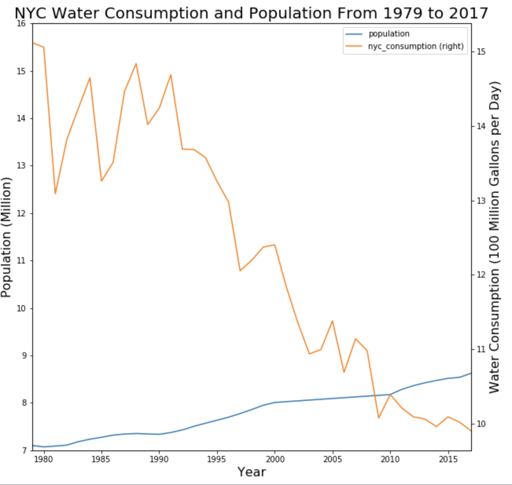

# Assignment 1
Individual Work

Completed the given skeleton notebook

# Assignment 2
Individual Work

Improved the plot from HW8 based on given feedbacks

Comments incorporated:
1. rescale y axis
2. change population unit to millions in correspondance to the other unit
3. represent the difference between the slopes of two lines

     
