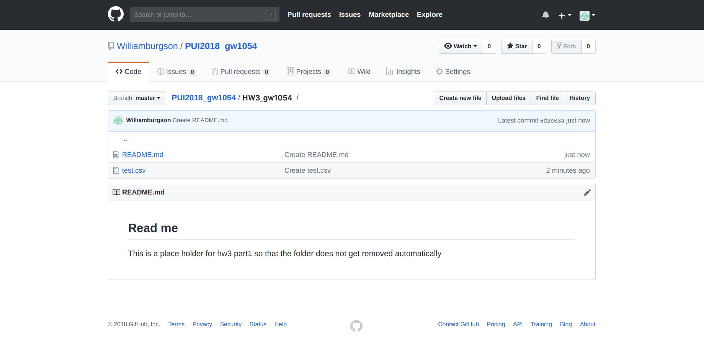
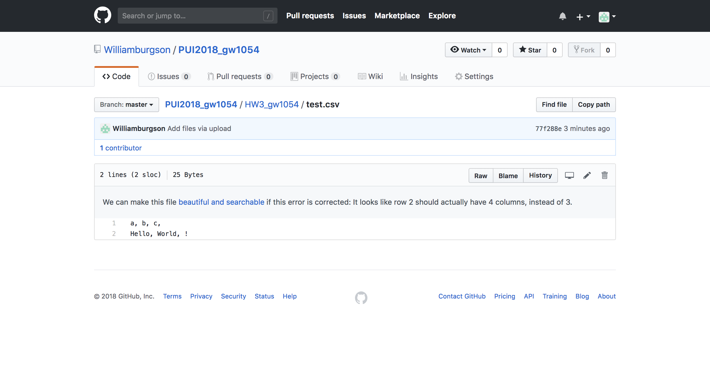
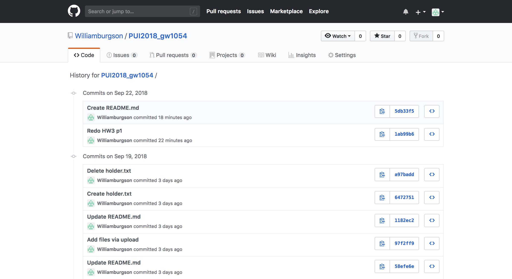

# Homework 3
## Part 1
Create a test.csv in the repository.

Pull the repository to local machine and run the provided command.

Force the repositroy to perform the same action and remove the copy of the test.csv file from server.

Delete both the file and the history of it.

## Part 2
Create dataframe through read_csv method

Display the first couple roles of the dataframe using dataframe.head

Slicing the dataframe by column names

Plot the dataframe using dataframe.plot

## Part 3 and 4
Create a complete api with command line arguments

Request data from the api and store the json object

Extract the portion of the data that is needed

Output to terminal or print to csv file
