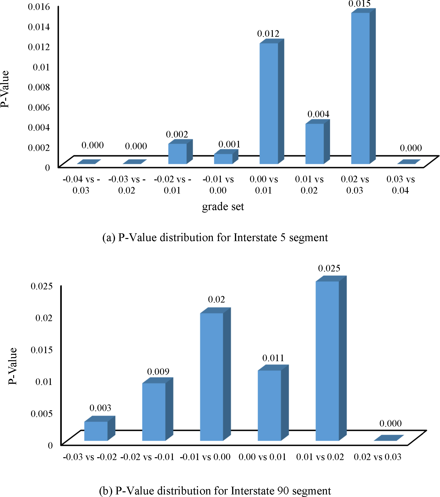
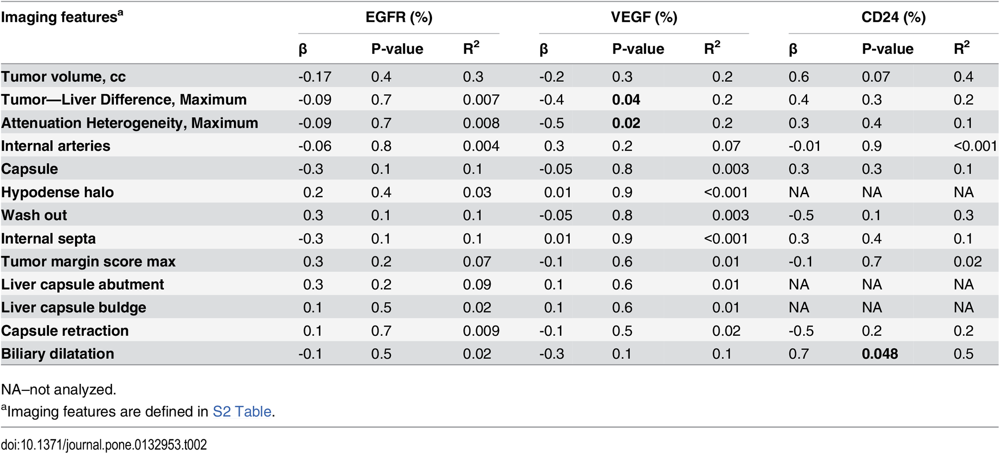

# Assignment 2
## t-Test
| **Statistical Analyses**	|  **IV(s)**  |  **IV type(s)** |  **DV(s)**  |  **DV type(s)**  |  **Control Var** | **Control Var type**  | **Question to be answered** | **_H0_** | **alpha** | **link to paper**| 
|:----------:|:----------|:------------|:-------------|:-------------|:------------|:------------- |:------------------|:----:|:-------:|:-------|
|t-Test|1, grade|continuous|1, speed|continuous|N/A |N/A |Whats the impacts of grades on vehicle speeds on interstate highways|  The average speed for the grade i is the same as the expected speed at grade i|0.05|https://journals.plos.org/plosone/article?id=10.1371/journal.pone.0184142#pone.0184142.e002|

## Correlation
| **Statistical Analyses**	|  **IV(s)**  |  **IV type(s)** |  **DV(s)**  |  **DV type(s)**  |  **Control Var** | **Control Var type**  | **Question to be answered** | **_H0_** | **alpha** | **link to paper**| 
|:----------:|:----------|:------------|:-------------|:-------------|:------------|:------------- |:------------------|:----:|:-------:|:-------|
|Correlation|1, Quantitative imaging phenotypes|continuous |1, expression of specific markers of hypoxia|continuous |N/A|N/A|How strong does quantitative imaging phenotypes correlates with expression of specific markers of hypoxia| quantitative imaging phenotypes does not correlate with expression of specific markers of hypoxia| 0.05 | https://journals.plos.org/plosone/article?id=10.1371/journal.pone.0132953|

