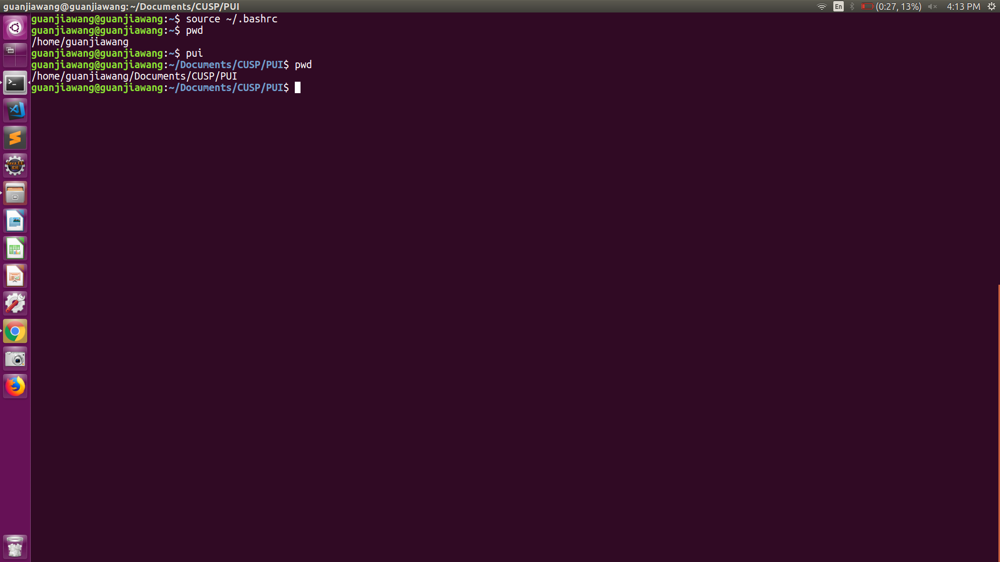
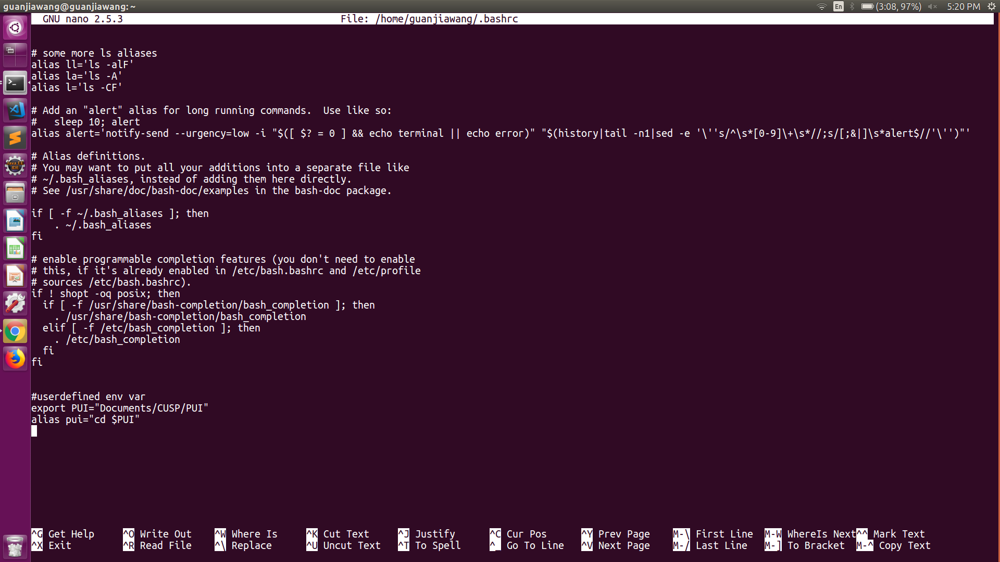

# PUI2018_gw105

## Create Environment Variable
use nano ~/.bashrc to open bash profile

scroll down to the bottom of the file to insert new variables

use export PUI="directory" to create a new environmental variable that points to the PUI2018 folder directory

use alias pui="cd $PUI" to create an alias pui that uses cd command to redirect to the PUI2018 directory

save and exit bash profile

restart terminal 

check command pui2018

## Screenshots

    
  
    
